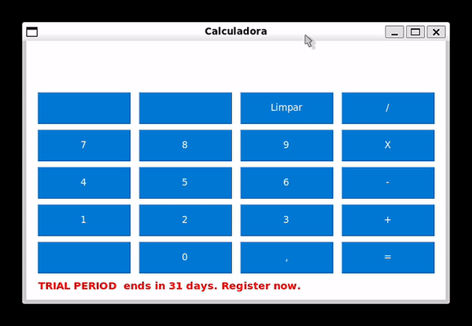

# Calculadora em Python


Este repositório contém uma calculadora desenvolvida em Python utilizando a biblioteca PySimpleGUI. O projeto foi realizado em conjunto com meus alunos da Escola Senai Alvares Romi com o objetivo de ensinar a utilização dessa biblioteca para criar interfaces gráficas de usuário de forma simples e eficiente.

## Visão Geral

A calculadora possui funcionalidades básicas de operações aritméticas (adição, subtração, multiplicação e divisão) e uma interface amigável desenvolvida com PySimpleGUI.

## Demonstração



## Motivação

Este projeto foi criado como parte de um curso de Python para ensinar meus alunos a desenvolverem interfaces gráficas utilizando Python e a biblioteca PySimpleGUI. A calculadora foi escolhida como exemplo por ser um projeto simples e que cobre os principais conceitos de desenvolvimento de GUI.

## Funcionalidades

- **Operações Básicas**: Adição, Subtração, Multiplicação e Divisão
- **Interface Gráfica**: Desenvolvida com PySimpleGUI
- **Entrada de Dados**: Utiliza botões para inserção de números e operações

## Tecnologias Utilizadas

- **Python**: Linguagem de programação principal
- **PySimpleGUI**: Biblioteca para criação de interfaces gráficas

## Pré-requisitos

- **Python 3.x**: Certifique-se de ter o Python 3.x instalado. Você pode baixar a versão mais recente [aqui](https://www.python.org/downloads/).

## Como Executar

1. **Clone o repositório**:
   ```bash
   git clone https://github.com/GiovanniRS/Calculadora-em-Python.git
   ```
2. **Instale as dependências**:
   ```bash
   pip install -r requirements.txt
   ```
3. **Execute o script**:
   ```bash
   python calculadora.py
   ```

## Estrutura do Projeto

```
Calculadora-em-Python/
│
├── calculadora.py      # Script principal da calculadora
├── README.md           # Documentação do projeto
├── requirements.txt    # Lista de dependências
└── LICENSE             # Licença do projeto
```

## Como Contribuir

Contribuições são bem-vindas! Siga os passos abaixo para contribuir:

1. **Fork o projeto**
2. **Crie uma branch para sua feature** (`git checkout -b feature/MinhaFeature`)
3. **Commit suas mudanças** (`git commit -m 'Adiciona MinhaFeature'`)
4. **Push para a branch** (`git push origin feature/MinhaFeature`)
5. **Abra um Pull Request**

## Licença

Este projeto está licenciado sob a licença MIT. Veja o arquivo [LICENSE](LICENSE) para mais detalhes.

## Links Úteis

- [Documentação do PySimpleGUI](https://pysimplegui.readthedocs.io/en/latest/)
- [Documentação do Python](https://docs.python.org/3/)

## Contato

Giovanni Rodrigues - [LinkedIn](https://www.linkedin.com/in/giovannirodrigues/)
